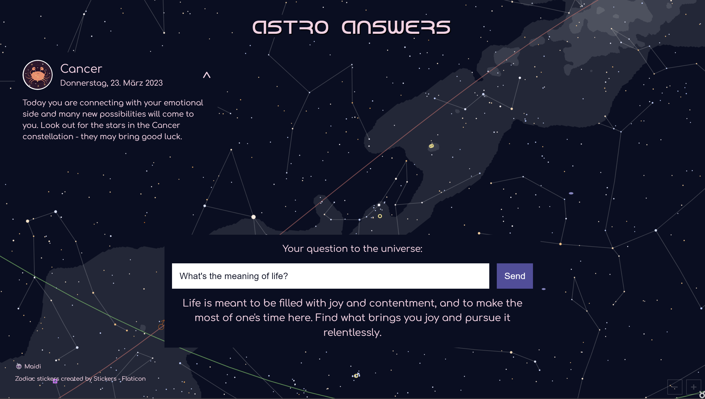

# Astro Answer 💫

## [https://astro-answer.com/](https://astro-answer.com/)
#### [Chrome Extension](https://chrome.google.com/webstore/detail/astro-answer/ngmlkghfcdahfgkakdnpghebgleiaimo) 
#### [Chrome New Tab Extension](https://chrome.google.com/webstore/detail/astro-answer-new-tab/kkaagpdbaejpeenfgeagkdljcfgacbnh) 

Astro answer is a simple web app that uses [D3 Celestial](https://github.com/ofrohn/d3-celestial) to render the actual 
star map and constellations according to your location. 
If you set your zodiac sign it gives an AI-generated small horoscope for the day.
The OpenAI model can be changed with the `OPENAI_MODEL` env var (default `gpt-5-mini`).

